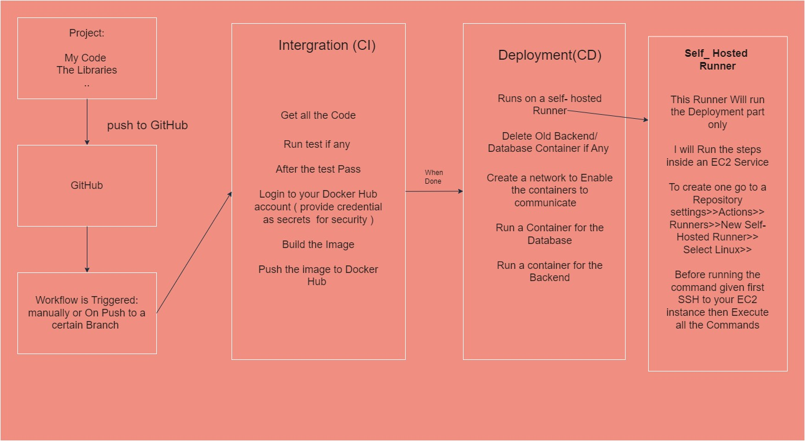

# How to Build a Backend Pipeline that Deploys a Node APP/ MSSQL Database to An EC2 Instance 



## Continous Intergration (CI)
# Let me explain the commands
### name: CI pipeline 
This is basically the Name of the pipeline 
```ruby
on: 
    push:
        branches:
            - master```

This explains what triggers the workflow: This means this workflow will be triggered only When someone pushes to the Master branch
You can also have other repository and github trigggers          

```ruby
jobs:
    build:
        runs-on: ubuntu-latest
        steps:
            - name: Get Code
              uses: actions/checkout@v4

            - name: Login DockerHub
              env:
                DOCKER_USERNAME: ${{secrets.DOCKER_USERNAME}}
                DOCKER_PASSWORD: ${{secrets.DOCKER_PASSWORD}}
              run: docker login -u $DOCKER_USERNAME -p $DOCKER_PASSWORD

            - name: Build the Docker Image
              run: docker build -t ndambuki/ci-backend-blogs .
            
            - name: Push to DockerHub
              run: docker push ndambuki/ci-backend-blogs:latest
            
```
### Lets break down the Code:

 ``` ruby 
    runs-on: ubuntu-latest
```
The runner used her is ubuntu-latest runner which one among many runners available . Each runner has some softwares installed so no need to install Node JS because the runner has that.
```ruby
    steps:
```
This specifies the steps to be taken 

```ruby
- name: Get Code
  uses: actions/checkout@v4
```

The above step 1 uses an Existing actions in the MarketPlace . The Action wil Download the Repository Code.

```ruby
- name: Login DockerHub
              env:
                DOCKER_USERNAME: ${{secrets.DOCKER_USERNAME}}
                DOCKER_PASSWORD: ${{secrets.DOCKER_PASSWORD}}
              run: docker login -u $DOCKER_USERNAME -p $DOCKER_PASSWORD
```

The above Code will login into your DockerHub using the Credential provided.To ensure security we provide them as Secret( once a secret is added it cannot be read )
to give secrets go to a Repository Settings>> Security> Secrets and Variables >> Actions >>  New Repository Secret > Add Key and Value

```ruby
 - name: Build the Docker Image
   run: docker build -t ndambuki/ci-backend-blogs .        
```
This will Build An Image the ubuntu-latest Runner has Docker installed.

```ruby
      - name: Push to DockerHub
        run: docker push ndambuki/ci-backend-blogs:latest
```
This will push the image built into your dockerHub account .


## Continous Deployment (CD)

```ruby
name: CD Pipeline
on:
    workflow_run:
        workflows: ["CI pipeline"]
        types:
            - completed
jobs:
    build:
        runs-on: self-hosted
        steps:
           
            - name: Delete Old Docker Container
              run:  sudo docker rm -f backend || true

            - name: Delete Network
              run: sudo docker network rm test || true

            - name: Delete Old DB Docker Container
              run:  sudo docker rm -f db || true

            - name: Delete Image
              run: sudo docker image rmi ndambuki/ci-backend-blogs || true

            - name: Delete Image
              run: sudo docker image rmi mcr.microsoft.com/mssql/server:2022-latest || true

            - name: Pull Docker Image
              run: sudo docker pull ndambuki/ci-backend-blogs
            

            - name: Create Network 
              run: sudo docker network create blog 

            - name: Run Database
              run: sudo docker run -e "ACCEPT_EULA=Y" -e "MSSQL_SA_PASSWORD=Root@2024" --name db --network blog -p 1433:1433 -d mcr.microsoft.com/mssql/server:2022-latest

            - name: Run Docker Container
              run: sudo docker run  -d -p 80:80 --network blog --name backend ndambuki/ci-backend-blogs


```
## Lets Break it Down

```ruby

    name: CD Pipeline

```

This Gives our Piplenine a Name

```ruby
on:
    workflow_run:
        workflows: ["CI pipeline"]
        types:
            - completed
```

This says that this workflow will run after the CI Pipeline is done.

```ruby
runs-on: self-hosted
```

This Part says that the Runner we are using here is Self-hosted 


```ruby

- name: Delete Old Docker Container
  run:  sudo docker rm -f backend || true
```

This commands delete aany existing backend container , If this Fails It will Still continue ( || True part)

```ruby
  - name: Delete Network
    run: sudo docker network rm test || true
```

This will delete the Network if it exists otherwise continue

```ruby

- name: Delete Old DB Docker Container
  run:  sudo docker rm -f db || true
```

This deletes existing Database container if any otherwise continue

```ruby
- name: Delete Image
  run: sudo docker image rmi ndambuki/ci-backend-blogs || true
```

Deletes Image if it exists This can help optimize storage e.g. if using a small EC2 machine

```ruby
- name: Delete Image
  run: sudo docker image rmi mcr.microsoft.com/mssql/server:2022-latest || true

```

Deletes the Database Image if it exists 


```ruby
 - name: Pull Docker Image
   run: sudo docker pull ndambuki/ci-backend-blogs
            
```

Downloads the latest docker Image

```ruby
 - name: Create Network 
   run: sudo docker network create blog 
```
Creates a  New Network Called Blogs
```ruby

- name: Run Database
  run: sudo docker run -e "ACCEPT_EULA=Y" -e "MSSQL_SA_PASSWORD=Root@2024" --name db --network blog -p 1433:1433 -d mcr.microsoft.com/mssql/server:2022-latest

```
Runs a new MSSQL container

```ruby          
- name: Run Docker Container
 run: sudo docker run  -d -p 80:80 --network blog --name backend ndambuki/ci-backend-blogs

 ```

 Runs a new Backend Container 